# Работоспособность и проделанная работа:  
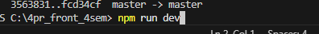 
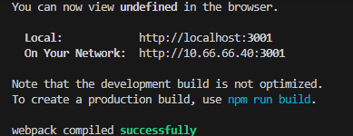 
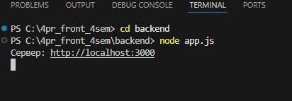 
- фронт запускается одной командой npm run dev, чтобы запускать реакт приложение и препроцессоры  
- бэк запускается из папки бэкенд командой node app.js  
 
 
## Работает свагер с документацией запросов и сами запросы тоже работают 

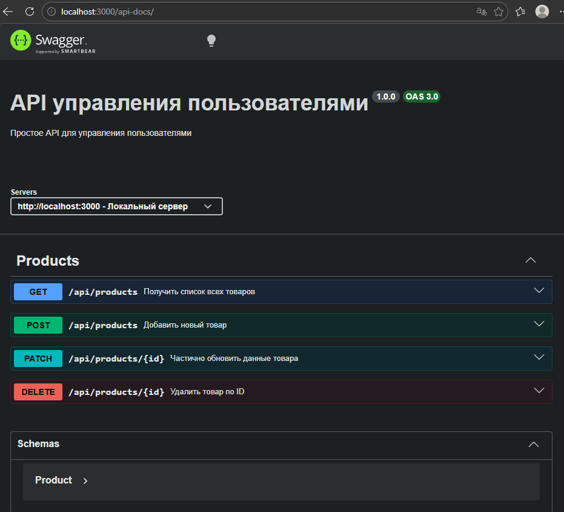 
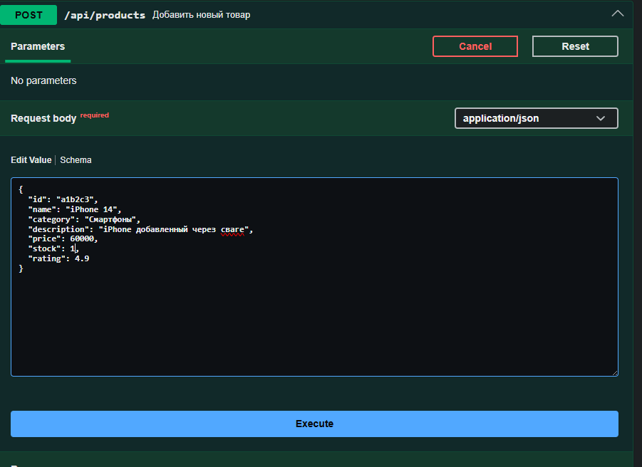 
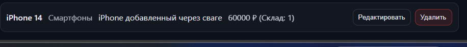 

## также реализованно минимальные требования задания - карточки, которые содержат:  название, категорию, описание товара, цену, количество на складе, а также работает добавление, удаление и редактирование товаров  
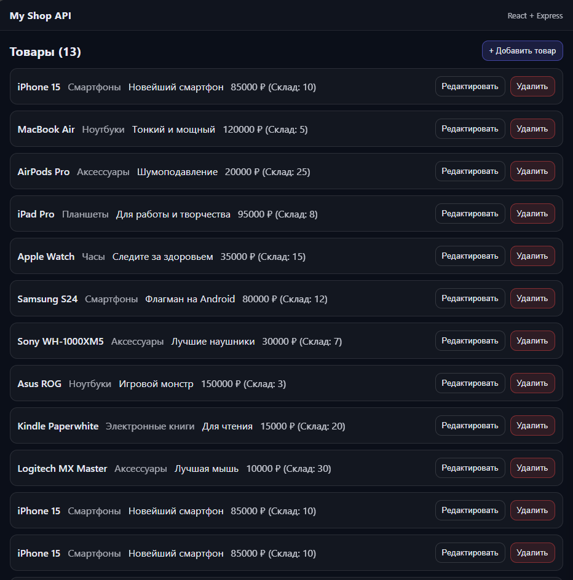 
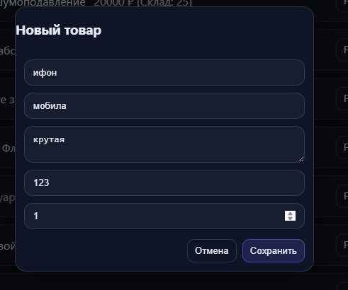 
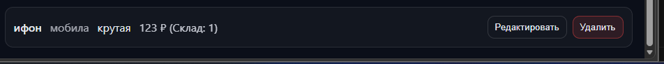 
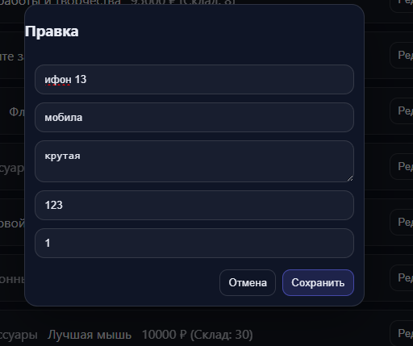 
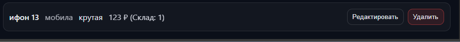 
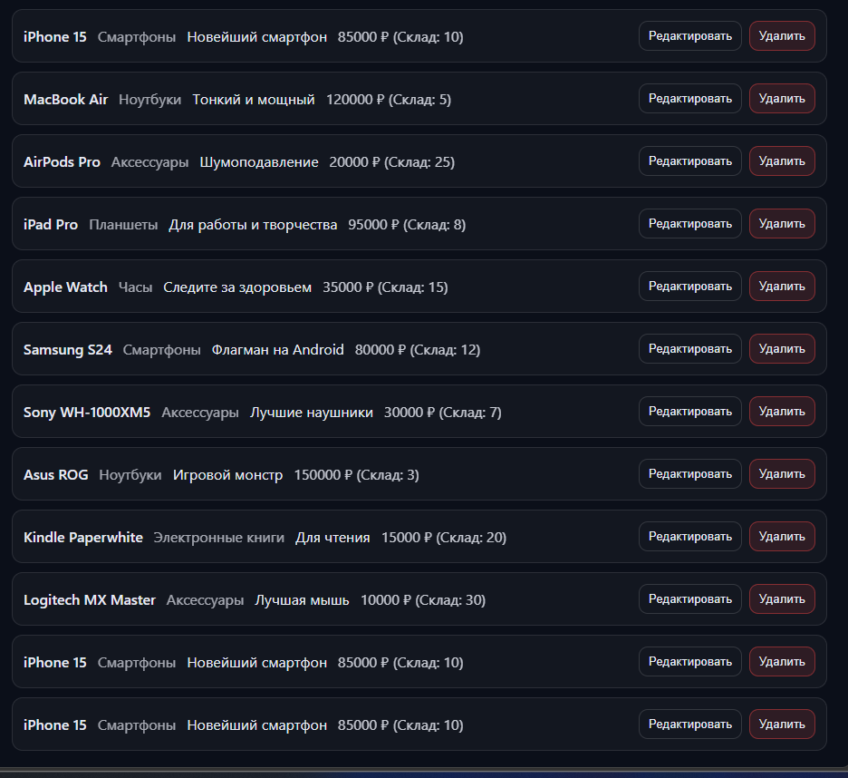 